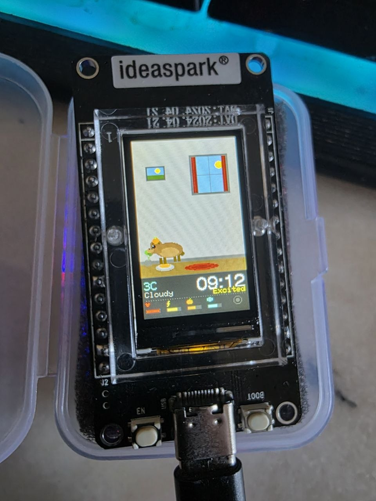
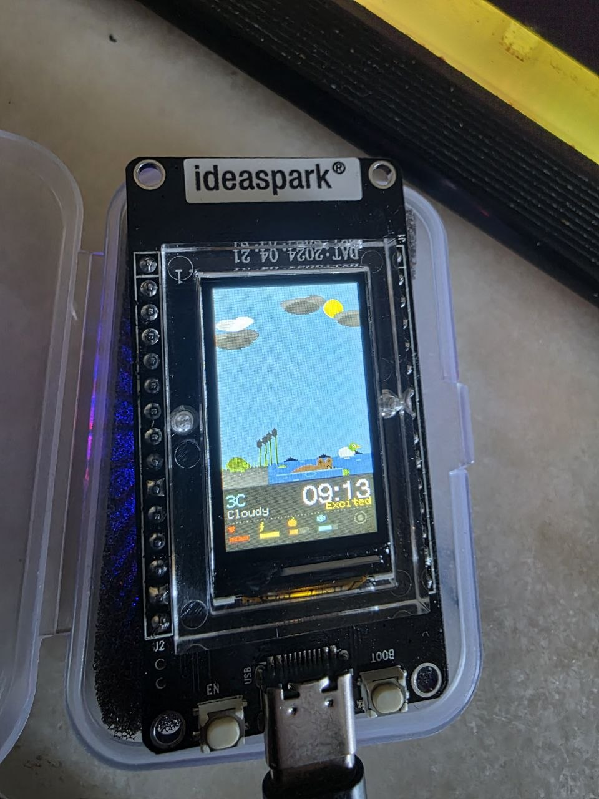
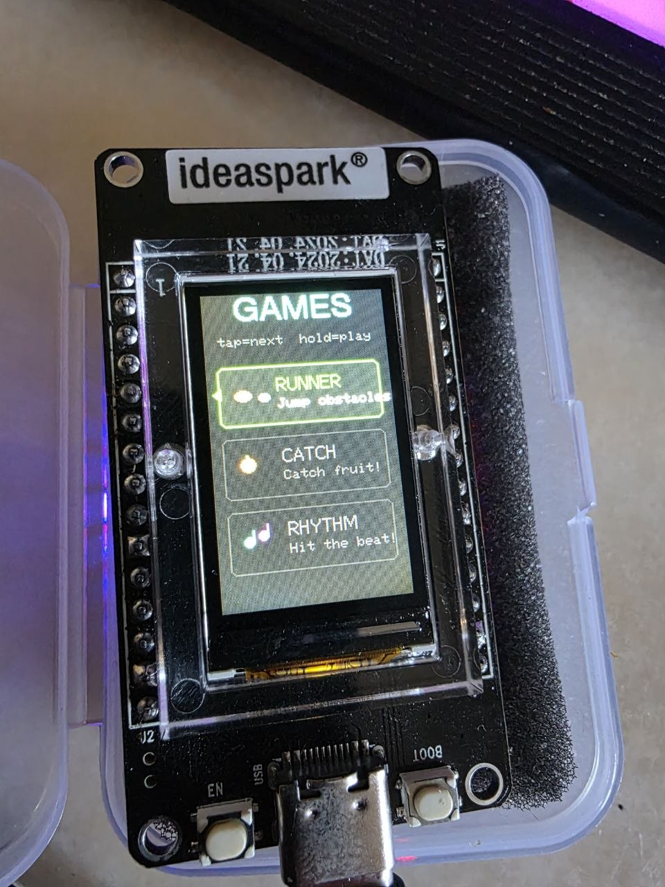
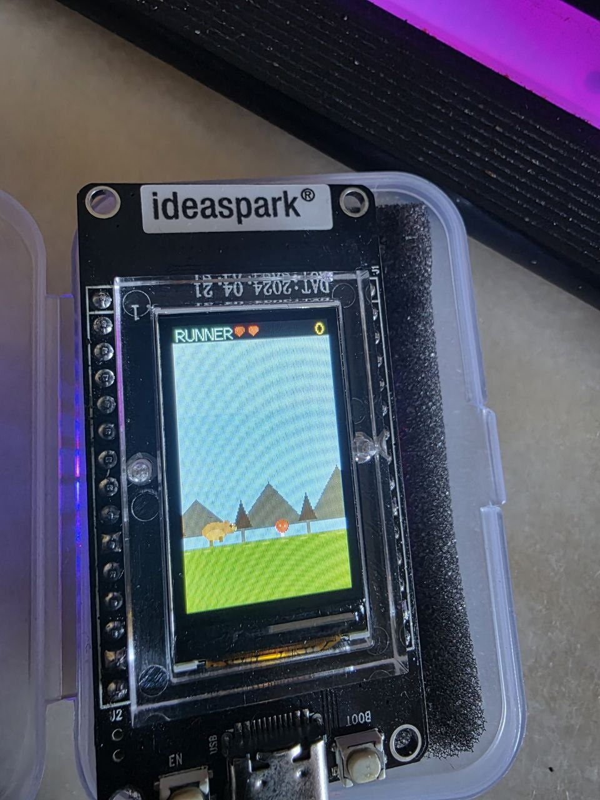

<h1 align="center">
  <br>
  CAPYBARA AI PET
  <br>
</h1>

<p align="center">
  <b>AI-Powered Virtual Pet on ESP32 Microcontroller</b>
  <br>
  <i>Deep Neural Network | Real-Time Weather | WiFi Presence Detection | Mini-Games</i>
</p>

<p align="center">
  
  
  
  
  
</p>

---

<p align="center">
  
  &nbsp;&nbsp;
  
  &nbsp;&nbsp;
  
</p>

---

## What is this?

A virtual pet capybara living inside a tiny ESP32 microcontroller with a 1.14" color display. The capybara thinks, eats, sleeps, swims, plays, and reacts to the real world through **WiFi** — it knows the weather outside, the current time, and even **senses when you're nearby** using WiFi signal analysis (CSI).

Its brain is a **deep neural network** (26 inputs -> 96 -> 48 -> 18 outputs) trained on 500,000 simulated decisions in Python, then deployed to run in **under 0.1ms** on the microcontroller.

## Features

### AI Brain
- **Deep Neural Network** with 8,130 parameters (26->96->48->18)
- Trained on **500,000** simulated behavioral decisions
- **26 input features**: stats, time, environment, weather, temperature, presence, behavior history
- Produces natural **behavior chains** (yawn -> stretch -> sleep, sniff -> eat)
- History-aware: won't repeat the same actions

### 18 Behaviors
`Idle (8 variants)` `Walk` `Run` `Eat Grass` `Eat Watermelon` `Swim` `Sleep` `Yawn` `Scratch` `Happy Jump` `Sit with Mikan` `Curious Sniff` `Stretch` `Play with Butterfly` `Look Around` `Shy` `Doze` `Run`

### 5 Smooth Transitions
Lie Down (before sleep) | Stand Up (after wake) | Sniff Before Eat | Look Then Walk | Turn Around

### Real-World Connection
| Feature | How |
|---------|-----|
| **Real-time weather** | Open-Meteo API (free, no key) — temperature, conditions |
| **Real clock** | NTP with timezone support (EET) |
| **Presence detection** | WiFi CSI — senses humans nearby via signal analysis |
| **Weather affects behavior** | Hot -> swims more, Cold -> sleeps, Rain -> stays home |

### 4 Environments

| Scene | Visual Elements |
|-------|----------------|
| **Meadow** | Rolling hills, swaying grass, flowers, butterflies |
| **Lake** | Water with 3 depth shades, shore, reeds, lilypads |
| **Forest** | Layered trees, mushrooms, moss, glowing fireflies |
| **Home** | Wall with wallpaper, wooden floor, window with curtains, painting, plant |

### 4 Weather Effects
**Clear** (sun with glow) | **Cloudy** (layered dark clouds) | **Rain** (drops + puddle ripples) | **Snow** (drifting flakes + accumulation)

### 3 Mini-Games

<p align="center">
  
</p>

| Game | Mechanic | Special Features |
|------|----------|-----------------|
| **Runner** | Jump over obstacles | Parallax scrolling, 3 obstacle types, speed ramp |
| **Catch** | Collect falling items | 5 item types, combo system, magnet + shield powerups |
| **Rhythm** | Hit notes on beat | 3 colored lanes, combo multiplier, dancing capybara |

### Stats & Mood System
- **5 Stats**: Happiness, Energy, Hunger (displayed as Satiety), Curiosity, Loneliness
- **7 Moods**: Happy, Content, Bored, Sleepy, Hungry, Excited, Curious
- **Cross-effects**: Hungry -> happiness drops, Tired -> curiosity drops
- **Persistent**: Saved to flash every 60s, survives reboots

### Status Bar
Real temperature with color coding | Weather icon | Real clock | Mood display | 4 stat bars with pixel icons | CSI presence indicator (green WiFi = someone nearby)

---

## Hardware

| Component | Spec |
|-----------|------|
| Board | Ideaspark ESP32 with integrated TFT |
| MCU | ESP32-D0WD-V3, Dual-core 240MHz |
| RAM | 520KB (327KB available) |
| Flash | 8MB |
| Display | ST7789 IPS, 135x240px, 65K colors |
| WiFi | 802.11 b/g/n, 2.4GHz |
| Input | 1 button (BOOT/GPIO 0) |
| Power | USB-C, ~200mA |

### Pin Configuration

| Signal | GPIO | Signal | GPIO |
|--------|------|--------|------|
| TFT MOSI | 23 | TFT RST | 4 |
| TFT SCLK | 18 | TFT BL | 32 |
| TFT CS | 15 | Button | 0 |
| TFT DC | 2 | | |

---

## Controls

| Context | Short Press | Long Press (1.5s) |
|---------|-------------|-------------------|
| Pet mode | Pet capybara (+happiness) | Open game menu |
| Game menu | Cycle: Runner / Catch / Rhythm | Start selected game |
| In game | Action (jump / reverse / hit) | Exit game |
| Game over | Dismiss | - |

---

## Neural Network

### Architecture
```
Input[26] --> Hidden1[96] --> Hidden2[48] --> Output[18]
              ReLU            ReLU           argmax
```

**8,130 parameters** | Trained on **500K samples** | **3,000 epochs** | Loss: **2.587**

### 26 Input Features
| # | Feature | Description |
|---|---------|-------------|
| 0-4 | Core Stats | Happiness, Energy, Hunger, Curiosity, Loneliness |
| 5-7 | Time | sin/cos encoding + night flag |
| 8-10 | Environment | One-hot: Lake, Forest, Home |
| 11 | Presence | WiFi CSI detection |
| 12-14 | Previous | Was sleeping / eating / active |
| 15-16 | Weather | Temperature + rain flag |
| 17-20 | Context | Stat trends + behavior duration |
| 21-25 | History | Category fractions in last 5 actions |

### Sample Predictions
| Scenario | Decision |
|----------|----------|
| Starving | **eat_grass 26%**, melon 26% |
| Exhausted at night | **sleep 21%**, doze 12%, yawn 6% |
| Bored at lake | **swim 15%**, sniff 12% |
| Curious in forest | **sniff 23%**, butterfly 14%, look 13% |
| Cold + rain at home | **sleep 31%**, doze 13%, mikan 7% |
| After lots of sleeping | **look 11%**, mikan 9% (NOT sleep!) |

---

## Tech Stack

| Layer | Technology |
|-------|-----------|
| Platform | Arduino on ESP-IDF |
| Build | PlatformIO CLI |
| Display | TFT_eSPI + TFT_eSprite (double buffered) |
| AI Training | Python + NumPy |
| AI Inference | Custom C++ forward pass (PROGMEM weights) |
| Weather | Open-Meteo API (free, no key) |
| Time | NTP + configTzTime (POSIX timezone) |
| JSON | ArduinoJson v7 |
| Storage | ESP32 Preferences (NVS) |

---

## Resource Usage

| Resource | Used | Available | % |
|----------|------|-----------|---|
| RAM | 49 KB | 328 KB | 15% |
| Flash | 1.0 MB | 8 MB | 14% |
| NN Weights | 33 KB | PROGMEM | 0% RAM |
| Frame Rate | 10 FPS | Stable | - |
| NN Inference | <0.1 ms | - | Negligible |

**85% RAM and 86% flash still free** for future expansion.

---

## Build & Flash

### Prerequisites
- [PlatformIO CLI](https://platformio.org/install/cli)
- USB-C cable
- Ideaspark ESP32 with ST7789 display

### Steps
```bash
# Clone
git clone https://github.com/DefinitelyN0tMe/esp32AIbara.git
cd esp32AIbara

# Build and flash
pio run -t upload

# Monitor serial output
pio device monitor
```

### Train the AI (optional)
```bash
cd train
pip install numpy
python train_brain.py
# Weights auto-exported to src/brain_weights.h
```

---

## Project Structure

```
esp32AIbara/
├── src/
│   ├── main.cpp           # App loop, rendering, WiFi, buttons
│   ├── pet_brain.h        # AI brain, stats, behaviors, save/load
│   ├── environments.h     # 4 scenes, weather effects, animals
│   ├── minigames.h        # 3 mini-games
│   ├── brain_weights.h    # 8,130 trained NN parameters
│   └── sprites.h          # Drawing helpers
├── train/
│   └── train_brain.py     # NN training script (Python)
├── docs/
│   └── images/            # Photos of the device
├── platformio.ini         # Build configuration
└── Capybara_Pet_Report.pdf # Full technical report
```

---

## Technical Challenges Solved

| Problem | Solution |
|---------|----------|
| GPIO 0 stuck LOW after SPI transfer | `pinMode(INPUT_PULLUP)` before every `digitalRead()` |
| Screen flickering | 64KB sprite double buffer |
| CSI callback never fires | Retry init + promiscuous mode + DNS pings |
| Game rewards applied multiple times | Apply directly in `endGame()` via pointer |
| Weather shown indoors | Skip `drawWeather()` when `env == HOME` |
| Capybara walks on water | Restrict position to shore when at lake |

---

## Future Ideas

- [ ] Reinforcement learning (learns from your button presses)
- [ ] Save/load multiple pet profiles
- [ ] Web control panel from phone
- [ ] OTA firmware updates
- [ ] Multiplayer — two capybaras visit each other via WiFi
- [ ] Sound via buzzer
- [ ] More mini-games
- [ ] Accessories (hats, scarves)

---

<p align="center">
  <b>Built with Claude Code</b>
  <br>
  <i>Hardware: Ideaspark ESP32 + ST7789 TFT | Location: Tallinn, Estonia</i>
</p>
